# pands-project

### This repository contains the solution to the project of the module: " Programming and Scripting" for the Higher Diploma in Computing in Data Analytics.
***
***

# 1. About this Repository

# 2. The Dataset
The objective of this project is about performing several analyses on the well-known Fisher’s Iris dataset. According to [UCI Machine Learning Repository](http://archive.ics.uci.edu/ml/datasets/Iris) and [Wikipedia](https://en.wikipedia.org/wiki/Iris_flower_data_set), this dataset quantifies the morphotic variation of 50 records for each of three Iris species:  Iris Setosa, Iris Virginica, and Iris Versicolor. Thus, the dataset is made of 150 samples which quantify the width and height of both the sepal and petal of each flower measured in centimetres. Thereby, The Fisher’s Iris dataset is composed of the following attributes: 
1. Sepal length in cm
2. Sepal width in cm
3. Petal length in cm
4. Petal width in cm
5. Class:  Iris Setosa, Iris Virginica, and Iris Versicolor

      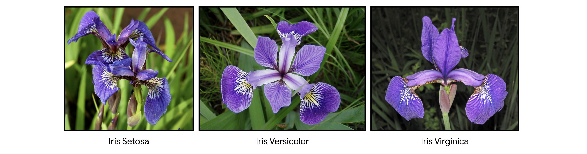

The dataset is named after a British statistician and biologist called Ronald Fisher, who introduced it in his 1936 paper about linear discriminant analysis called "The use of multiple measurements in taxonomic problems as an example of linear discriminant analysis". I would like to point out that this dataset is so popular that it has been used since its creation as a test case throughout the data analytics field, such as machine learning and data mining. 

The dataset has been added to the repository in a CSV file called "iris-data.csv", which has been downloaded from The UCI Machine Learning Repository website [link here](http://archive.ics.uci.edu/ml/machine-learning-databases/iris/). 

# 3. Analysis of The Iris Dataset
The analysis of the dataset has been split into two sections, which are clearly specified in the code. In the first section called "Analysis Per Variable", I realised some different analyses focus on each individual variable. On the other hand, the second section contains an analysis of each quantitative variable (sepal length, sepal width, petal length and petal width) grouped by the variable class. You can find this second section in the code by the name "Analysis of Each Quantitative Variable Grouped by Iris Species".

I would like to point out that within these sections the code has been organized into different subsections so I am going to follow the same structure throughout the explanation of the analysis in order to make it easier to follow. 

After this clarification, I proceed to expose the research carried out on the database and the insights obtained.

## 3.1. Analysis Per Variable
This section is divided into five subsections in which as a first step, a brief description of the dataset is made in order to obtain a better knowledge of the database that we have and the type of analyses suitable for it. In addition, we carry out a summary of each variable and different types of visualizations, which allow us to form hypotheses, uncover potential patterns in the data and identify strongly correlated variables.

Without further ado, I will present the insights obtained in this first section of the analysis.

### 3.1.1. Brief Description of The Dataset
 The very first step required in the data analysis process involves exploring the dataset we have for the purpose of getting a better understanding of the data that is going to be analysed. By getting to know the data better, we can become more efficient in navigating through the data and using them in our analysis([Pomiklo, 2021](https://dsstream.com/data-exploration-definition-and-techniques/)).

In this section, the Pandas library was used since it has many functions that can be used to explore a dataset. First of all, I used the `info()` method, which allows us to print out a piece of brief information about the Iris dataset such as the number of columns, column labels, column data types, memory usage, etc...

We can see that the dataset is composed of 150 records and there are no null values. Moreover, four variables are float data types (sepal length, sepal width, petal length and petal width) and the fifth column is an object data type (class). 

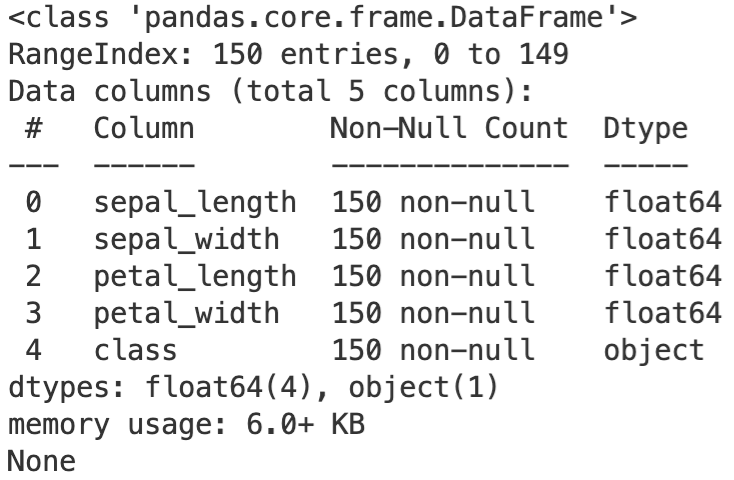

To finish this section, the Pandas `head()` method has been used. This function is useful to take a quick look at how the database is structured. In this case, it displays the first ten rows of the dataset.

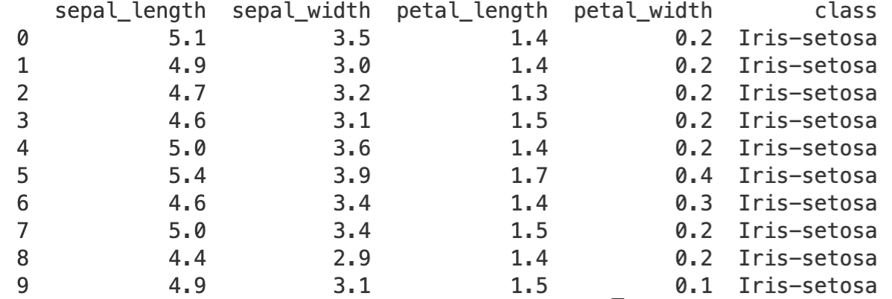

I would like to point out that the two previous tables are printed out when you run the code so they are not saved into a file as all the next analyses ([Sharma, 2021](https://medium.com/analytics-vidhya/exploratory-data-analysis-iris-dataset-4df6f045cda)).

### 3.1.2. Summary of Each Variable
As the next step in my exploratory data analysis, I have used the Pandas `describe()` method to obtain a statistical summary of each variable([InDeepData, 2021](https://indeepdata.com/blog/exploratory-data-analysis/)). This information is sent to a text file called "variables_summary" once you run the code.

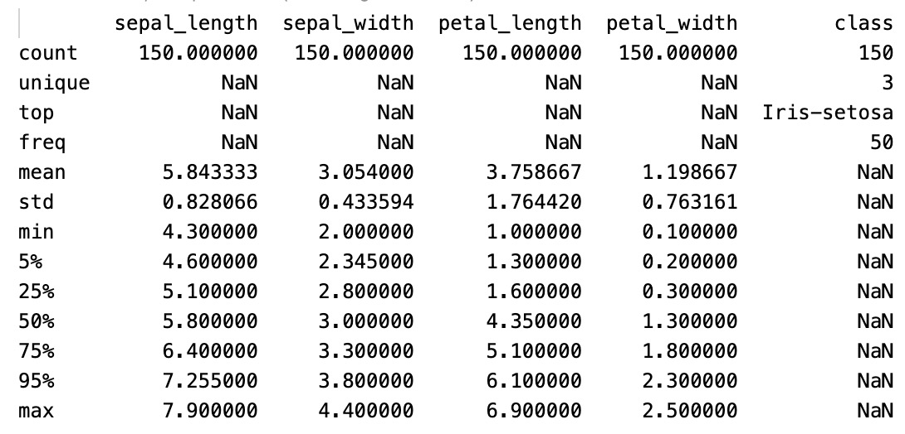

From the previous table we can get the following insights:
* There are 50 observations for each Iris specie in the dataset.
* The sepal and petal are usually longer than they are wide. Also, we can see that the sepals are on average bigger than the petals.
* The standard deviation shows that there is more variability in the petal measurements than in the sepal ones.
* The maximum value in the sample is reached by the sepal length variable with 7.9 cm and the minimum is reached by the petal width variable with 0.1 cm. 

### 3.1.3. Histogram of Each Quantitative Variable

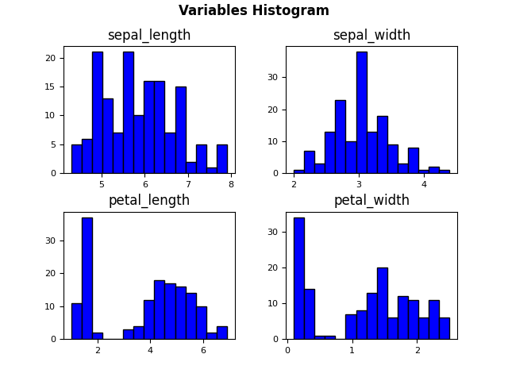	

### 3.1.4. Bar Plot for The Variable "Class"

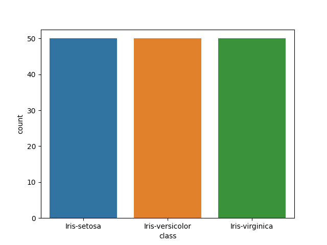	

#### 3.1.5. Correlation Between Variables

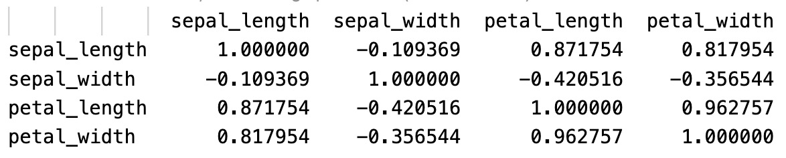

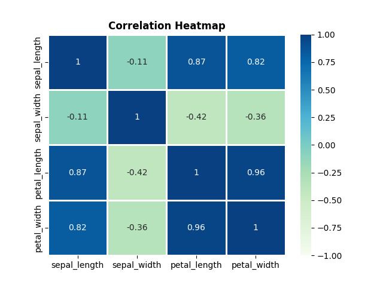

-------------------------------------	

## 3.2. Analysis of Each Quantitative Variable Grouped by Iris Species

### 3.2.1. Summary of Each Variable Grouped by Iris Species

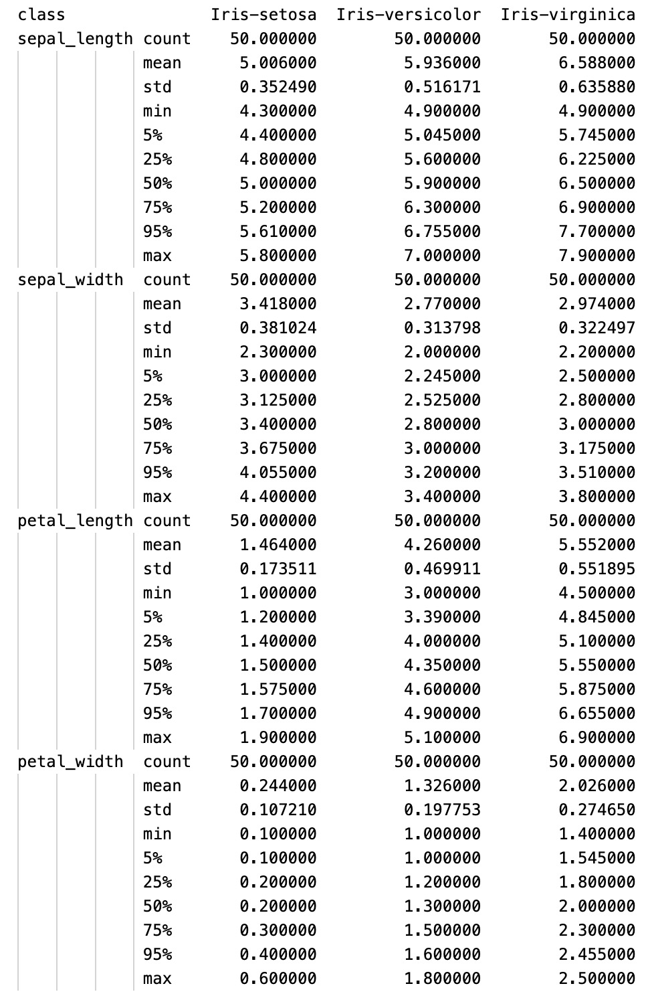

### 3.2.2. Histogram of Each Quantitative Variable Grouped by Iris Species

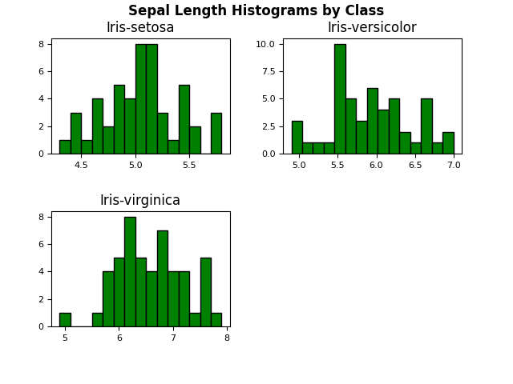
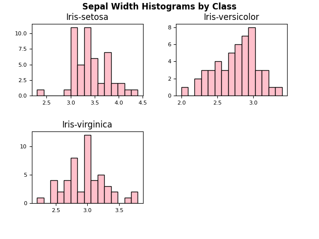
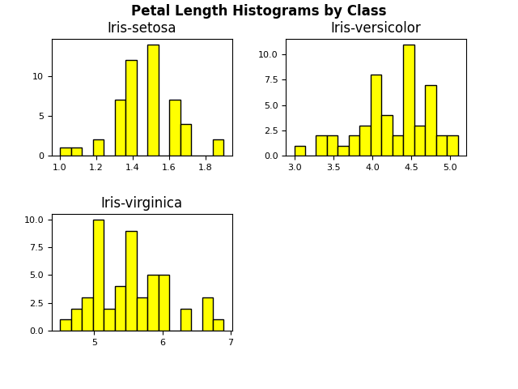
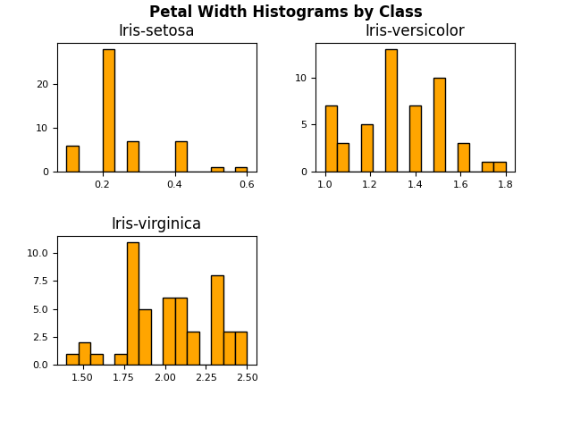

###  3.2.3. Scatter Plot of Each Pair of Variables

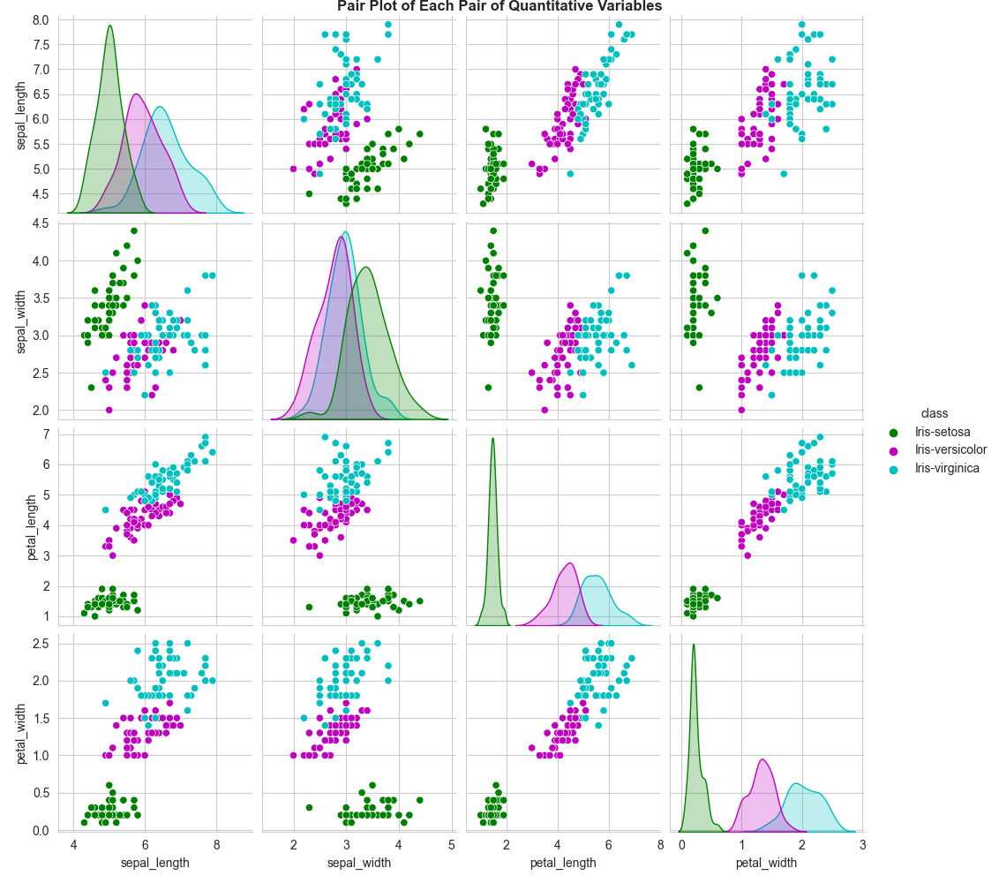

###  3.2.4. Box Plot of Each Quantitative Variable Grouped by Iris Species

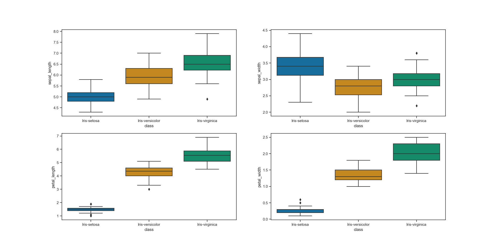

###  3.2.5. Correlation Between Variables Grouped by Iris Species

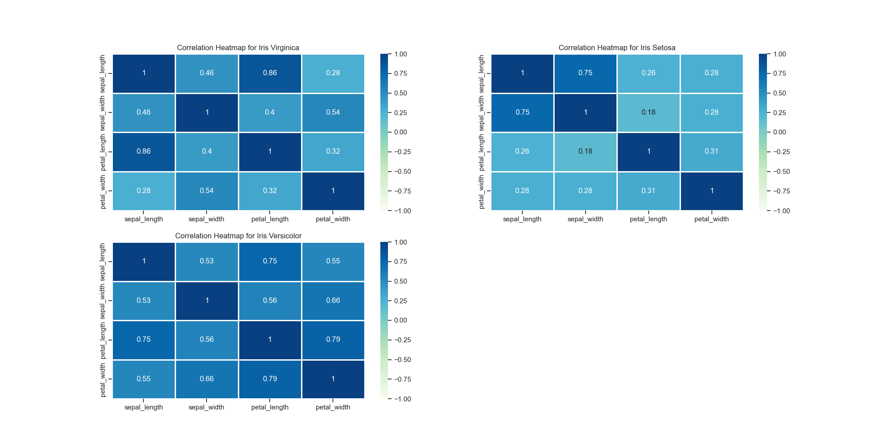

# 4. Conclusions

# 5. References

https://www.codegrepper.com/code-examples/python/pandas+read+csv+without+index
https://pandas.pydata.org/docs/user_guide/io.html#io-read-csv-table
https://www.adamsmith.haus/python/answers/how-to-set-column-names-when-importing-a-csv-into-a-pandas-dataframe-in-python#:~:text=Call%20pandas.,order%20they%20appear%20in%20names%20.
https://www.sharpsightlabs.com/blog/pandas-describe/
https://pandas.pydata.org/docs/reference/api/pandas.DataFrame.describe.html
https://github.com/andrewbeattycourseware/pands2022/blob/main/jupyternotebooks/Topic07%20files.ipynb
https://pandas.pydata.org/docs/reference/api/pandas.DataFrame.to_string.html
https://www.w3schools.com/python/pandas/ref_df_info.asp#:~:text=The%20info()%20method%20prints,method%20actually%20prints%20the%20info. 
https://www.w3resource.com/pandas/dataframe/dataframe-head.php
https://moonbooks.org/Articles/How-to-create-an-histogram-from-a-dataframe-using-pandas-in-python-/
https://stackoverflow.com/questions/31596084/save-dataframe-hist-to-a-file
https://www.marsja.se/how-to-plot-a-histogram-with-pandas-in-3-simple-steps/
https://www.machinelearningplus.com/pandas/pandas-histogram/
https://datagy.io/histogram-python/
https://pandas.pydata.org/docs/reference/api/pandas.DataFrame.hist.html
https://stackoverflow.com/questions/19614400/add-title-to-collection-of-pandas-hist-plots
https://www.includehelp.com/python/bold-text-label-in-plot.aspx
https://www.oreilly.com/library/view/python-data-science/9781491912126/ch04.html
https://matplotlib.org/stable/gallery/text_labels_and_annotations/titles_demo.html
https://towardsdatascience.com/visualizing-data-with-pair-plots-in-python-f228cf529166
https://www.tutorialspoint.com/increase-the-distance-between-the-title-and-the-plot-in-matplotlib
https://seaborn.pydata.org/generated/seaborn.pairplot.html
https://seaborn.pydata.org/generated/seaborn.set_style.html
https://goodboychan.github.io/python/datacamp/visualization/2020/06/27/01-Customizing-Seaborn-Plots.html
https://wellsr.com/python/seaborn-scatter-plot-with-sns-scatterplot/
https://stackoverflow.com/questions/37734512/savefig-loop-adds-previous-plots-to-figure?fbclid=IwAR101W3aPSKbrgkL3Yu7aDcehCFMBPVBF055xb1iNDqQE-AuM0Mjn4ArKaE
https://www.adamsmith.haus/python/answers/how-to-find-the-correlation-between-two-pandas-dataframe-columns-in-python
https://github.com/andrewbeattycourseware/pands2022/blob/main/jupyternotebooks/Topic07%20files.ipynb
https://pandas.pydata.org/docs/reference/api/pandas.DataFrame.boxplot.html
https://nickmccullum.com/python-visualization/boxplot/
https://matplotlib.org/stable/tutorials/colors/colormaps.html
https://seaborn.pydata.org/generated/seaborn.heatmap.html
https://towardsdatascience.com/heatmap-basics-with-pythons-seaborn-fb92ea280a6c
https://www.statology.org/seaborn-subplots/ 
https://stackoverflow.com/questions/52274643/figsize-in-matplotlib-is-not-changing-the-figure-size
https://pandas.pydata.org/docs/reference/api/pandas.DataFrame.groupby.html
https://pandas.pydata.org/docs/reference/api/pandas.DataFrame.transpose.html
https://towardsdatascience.com/matplotlib-seaborn-basics-2bd7b66dbee2
https://s3.amazonaws.com/assets.datacamp.com/production/course_6919/slides/chapter2.pdf
https://seaborn.pydata.org/tutorial/color_palettes.html
https://seaborn.pydata.org/generated/seaborn.countplot.html
https://stackoverflow.com/questions/10035446/how-can-i-make-a-blank-subplot-in-matplotlib
https://stackoverflow.com/questions/32723798/how-do-i-add-a-title-and-axis-labels-to-seaborn-heatmap
https://stackoverflow.com/questions/14734533/how-to-access-pandas-groupby-dataframe-by-key
https://gist.github.com/MichaelPolla/a65ac84286ab523603e64549f9850223
https://www.w3schools.com/tags/tag_img.asp

